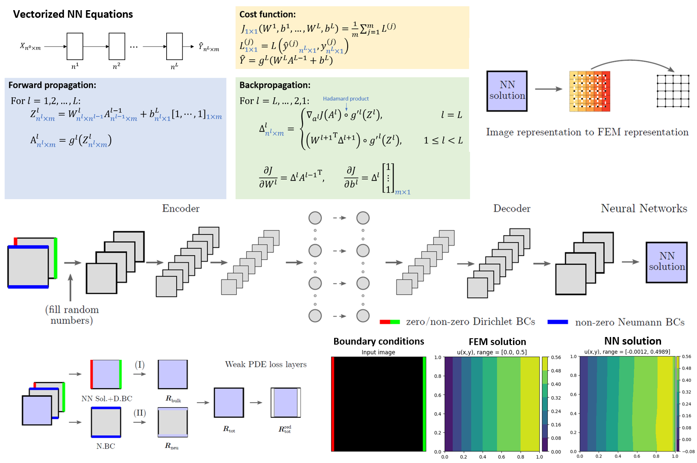

## Overview
This repository contains project codes and slides for a mini-lecture designed to introduce neural networks, with a specific application in solving Partial Differential Equations (PDEs). Developed and taught by [Mostafa Shojaei](https://www.linkedin.com/in/mostafa-fsh/), this lecture serves as the concluding part of the Finite Element Method course (MECHENG 505) instructed by [Prof. Krishna Garikipati](https://sites.google.com/umich.edu/krishna/) during the Winter and Fall semesters of 2023 at the University of Michigan.

The aim of this series is to acquaint students with the fundamental concepts of Neural Networks (NNs), Convolutional Neural Networks (CNNs), Machine Learning (ML), and Deep Learning (DL). A distinctive feature of this series is the application of these computational techniques, particularly neural networks with uniquely designed cost functions, to solve PDEs. This approach offers an innovative method for complex problem-solving in engineering and science.

## Acknowledgments
This project code is designed based on the framework presented in [Zhang, X. & Garikipati, K. (2023). Label-free Learning of Elliptic PDE Solvers with Generalizable Boundary Value Problems. Comp. Meth. in Appl. Mech. Eng., 116214](https://doi.org/10.1016/j.cma.2023.116214). Lecture materials are referenced on the respective slides. A primary resource includes publicly available materials by Andrew Ng on the relevant topics.
